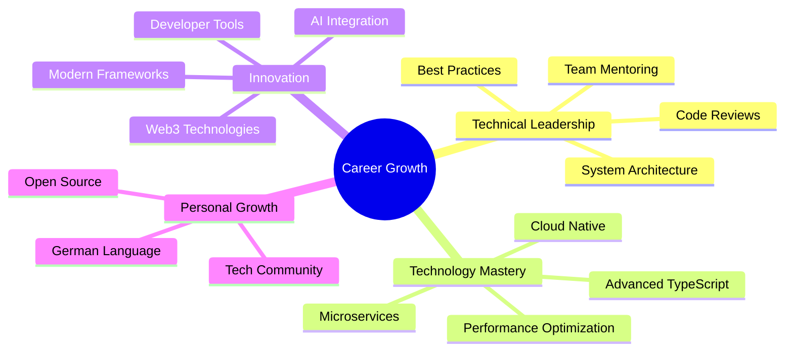

<div align="center">

[](https://github.com/edisonaugusthy/edisonaugusthy/actions)
[](https://github.com/edisonaugusthy/edisonaugusthy/blob/master/LICENCE)


</div>

<p align="center">
  
</p>

<div align="center">
  
[](https://www.linkedin.com/in/edison-augusthy-403837129)
[](mailto:edisonaugusthy@outlook.com)
[](https://github.com/edisonaugusthy)
[](https://stackoverflow.com/users/6781625/edison)
[]()

</div>


##  About Me

```yaml
name: Edison Augusthy
location: Munich, Germany 🇩🇪
specialization: React, Angular, Node.js, TypeScript, Blockchain

career_journey:
  current: "Senior Software Engineer @ Twisted Mountain Animation"
  previous:
    - "Senior Software Engineer @ Ernst & Young (EY)"
    - "Software Engineer @ Think Palm"
    - "Software Engineer @ Feathersoft"

expertise:
  - "Full-Stack Web Development"
  - "Blockchain & Web3 Technologies"
  - "Microservices Architecture"
  - "Cloud Solutions (AWS, Azure)"
  - "Team Leadership & Mentoring"
philosophy: "Building scalable solutions with clean code principles"
```

<br clear="right"/>

## 🛠️ Technology Stack

### **⚛️ Frontend Development**


### **⚙️ Backend Development**


### **🗄️ Databases & Message Queues**


### **🔗 Blockchain & Web3**


### **☁️ Cloud & DevOps**


### **🧪 Testing & Quality Assurance**


## 🏆 GitHub Achievements

<div align="center">
  
</div>

## 📊 Coding Analytics

[](https://github.com/ashutosh00710/github-readme-activity-graph)

<div align="center">


</div>

<div align="center">


</div>

## ⏰ Weekly Development Breakdown

<!--START_SECTION:waka-->


**🐱 My GitHub Data**

> 📦 285.7 kB Used in GitHub's Storage
>
> 🏆 1,247 Contributions in the Year 2025
>
> 💼 Opted to Hire
>
> 📜 68 Public Repositories
>
> 🔑 32 Private Repositories

**I'm an Early 🐤**

```text
🌞 Morning                1,245 commits       ████░░░░░░░░░░░░░░░░░░░░░   19.12 %
🌆 Daytime                2,890 commits       ███████████░░░░░░░░░░░░░░   44.38 %
🌃 Evening                1,876 commits       ███████░░░░░░░░░░░░░░░░░░   28.79 %
🌙 Night                  503 commits         ██░░░░░░░░░░░░░░░░░░░░░░░   07.71 %
```

📊 **This Week I Spent My Time On**

```text
🕑︎ Time Zone: Europe/Berlin

💬 Programming Languages:
TypeScript               12 hrs 45 mins      ██████████████░░░░░░░░░░░   54.23 %
React                    6 hrs 18 mins       ███████░░░░░░░░░░░░░░░░░░   26.82 %
Node.js                  2 hrs 32 mins       ███░░░░░░░░░░░░░░░░░░░░░░   10.81 %
GraphQL                  1 hr 15 mins        █░░░░░░░░░░░░░░░░░░░░░░░░   05.34 %
SCSS                     38 mins             █░░░░░░░░░░░░░░░░░░░░░░░░   02.72 %

```

Last Updated on 19/07/2025 12:52:06 UTC

<!--END_SECTION:waka-->

## 🔥 Recent GitHub Activity

<!--START_SECTION:activity-->

1. 💪 Opened PR [#62059](https://github.com/angular/angular/pull/62059) in [angular/angular](https://github.com/angular/angular)
2. ❌ Closed PR [#62058](https://github.com/angular/angular/pull/62058) in [angular/angular](https://github.com/angular/angular)
3. 💪 Opened PR [#62058](https://github.com/angular/angular/pull/62058) in [angular/angular](https://github.com/angular/angular)
4. ❌ Closed PR [#64](https://github.com/edisonaugusthy/ng-storage/pull/64) in [edisonaugusthy/ng-storage](https://github.com/edisonaugusthy/ng-storage)
5. ❌ Closed PR [#65](https://github.com/edisonaugusthy/ng-storage/pull/65) in [edisonaugusthy/ng-storage](https://github.com/edisonaugusthy/ng-storage)
<!--END_SECTION:activity-->

## 🎯 Current Focus & Goals



<br clear="right"/>

## 🌐 Let's Connect

<div align="center">

_I'm passionate about building scalable solutions that make a real impact. Let's connect and discuss how we can create something amazing together!_

[](mailto:edisonaugusthy@outlook.com)

</div>

---

<div align="center">

**✨ "Clean code is not written by following a set of rules. You don't become a software craftsman by learning a list of heuristics. Professionalism and craftsmanship come from values that drive disciplines." - Robert C. Martin ✨**

</div>


